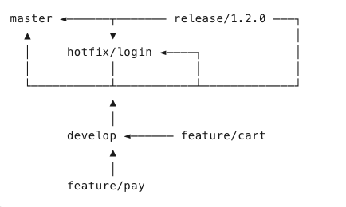

# Servlet-samples README

This repository contains a collection of sample servlets that demonstrate how to use the Java Servlet API. The samples are organized by topic and are intended to be used as a reference for developers who are learning how to build web applications using servlets.

## Getting Started

To run the samples in this repository, you will need to have a Java Development Kit (JDK) installed on your machine. You can download the latest version of the JDK from the [Oracle website](https://www.oracle.com/java/technologies/javase-jdk11-downloads.html).

You will also need to have a servlet container installed on your machine. The samples in this repository are designed to run on the Apache Tomcat servlet container, which you can download from the [Apache Tomcat website](https://tomcat.apache.org/download-90.cgi).

## Running the Samples

To run the samples in this repository, follow these steps:

1. Clone the repository to your local machine:

   ```bash
   git clone
   
    ```
   
2. Navigate to the root directory of the repository:

   ```bash
   cd servlet-samples
   ```
   
3. Start the Apache Tomcat servlet container:

   ```bash
   
    ```
   
4. Deploy the sample servlets to the servlet container:

   ```bash
   
    ```
   
5. Open a web browser and navigate to the following URLs to view the sample servlets:

    - `http://localhost:8080/servlet-samples/hello`
    - `http://localhost:8080/servlet-samples/form`
    - `http://localhost:8080/servlet-samples/cookies`
    - `http://localhost:8080/servlet-samples/sessions`
    - `http://localhost:8080/servlet-samples/filters`
    - `http://localhost:8080/servlet-samples/listeners`

## Contributing

If you would like to contribute to this repository, please open an issue or submit a pull request. We welcome contributions from the community and are always looking for ways to improve the samples in this repository.

## License

This repository is licensed under the MIT License. See the [LICENSE](LICENSE) file for more information.

## Acknowledgements

The samples in this repository are based on the [Java Servlet API](https://docs.oracle.com/javaee/7/api/javax/servlet/package-summary.html) and the [Apache Tomcat documentation](https://tomcat.apache.org/tomcat-9.0-doc/index.html). We would like to thank the authors of these resources for their valuable contributions to the Java community.


=====

分支管理:
1. 核心分支
1.1 main (或 master)     # 主分支 - 永远是可发布的稳定版本
1.2 develop              # 开发分支 - 集成了所有已完成功能

2. 辅助分支
2.1 feature/*            # 功能分支 - 开发新功能
2.2 release/*            # 发布分支 - 准备发布版本
2.3 hotfix/*             # 热修复分支 - 紧急修复生产问题
2.4 support/*            # 支持分支 - 维护旧版本（可选）

| 分支 | 存在周期 | 起点 | 终点 | 允许谁 merge 进来 | 禁止谁 merge 出去 |
|---|---|---|---|---|---|
| master | 永久 | 空 | 无 | 仅 release/hotfix | 禁止直接 commit |
| develop | 永久 | master | 无 | feature, hotfix | 禁止直接 commit |
| feature/* | 临时 | develop | develop | 开发者任意 commit | 禁止直接 merge 到 master |
| release/* | 临时 | develop | master + develop | 仅 bugfix | 禁止新功能 |
| hotfix/* | 临时 | master | master + develop | 仅 bugfix | 禁止新功能 |



测试提交